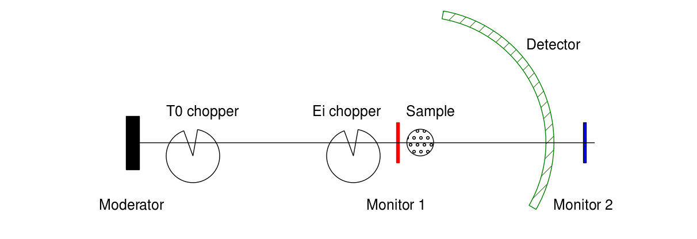
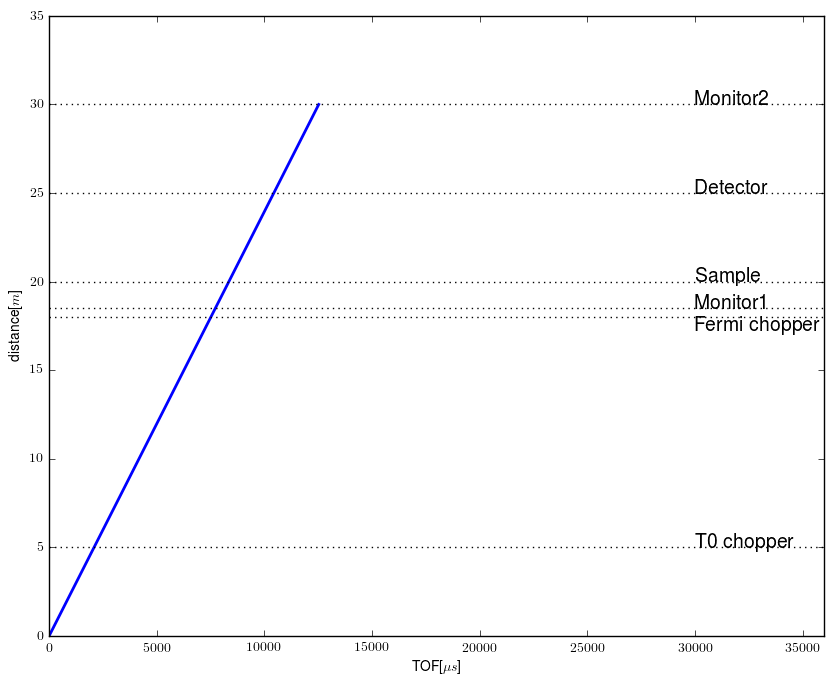
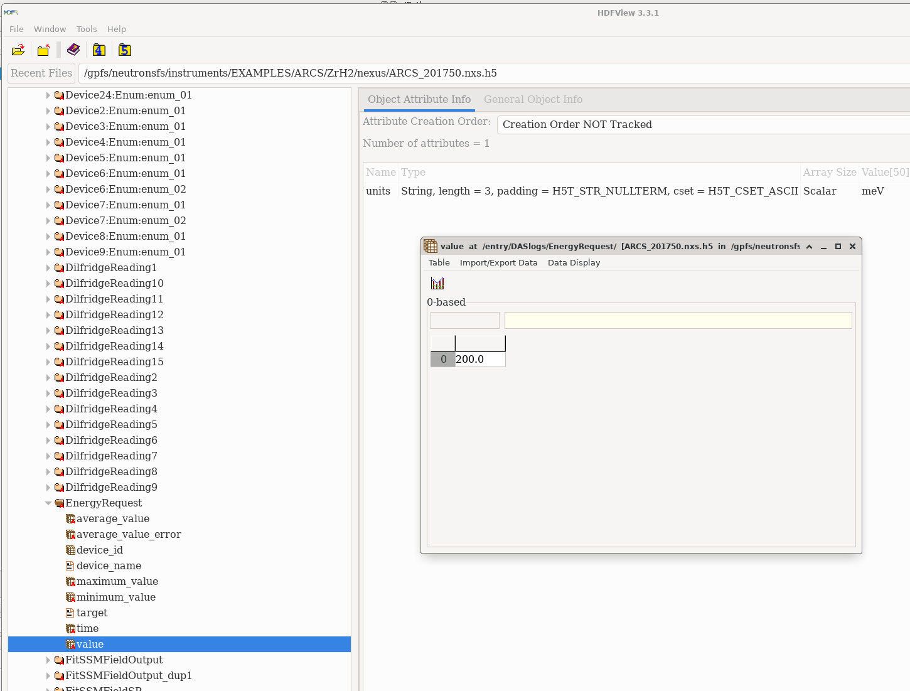

Determining incident beam parameters for DGS instruments
========================================================

Introduction
------------
Direct geometry spectroscopy (DGS) is a neutron time of flight technique that measures scattering intensity as a function
of energy and momentum transfer. Since one can measure the detection time of a particular neutron, and one know when it is produced,
one needs to fix either the incident energy (DGS) or the final energy (indirect geometry), in order to calculate energy and momentum transfer.
For DGS instruments, a device called chopper is transparent to neutrons only for brief periods of time. Knowing the positions of 
the moderator (the source of neutrons) and the chopper, one can select that the opening time occurs only for neutrons with a 
certain velocity (energy). 

Note that there is an uncertainty in the time when neutrons leave the moderator. So we are interested
in measuring the real energy of the neutrons and this time offset. Experimentally we use two monitors with known positions.
We measure when neutrons arrive each monitor, and the time difference will allow us to compute the energy. We can extrapolate
assuming constant velocity, and find out the time when neutrons left the moderator. The velocities involed in this problem 
are not relativistic, so energy is related to neutron mass and velocity via $E = mv^2/2$ (a 25 meV neutron has a speed of about 2.2 km/s).

Let $t_{1,2}$ be the detection times of neutrons at monitor 1 and 2, with positions $d_1$ and $d_2$ along the z-axis. The moderator
position is $d_0$, and the neutrons leave the moderator at time $t_0$. Then we can write velocity as
$$v=\frac{d_{1,2}-d_0}{t_{1,2}-t_0}$$
You can get from here that $$v=\frac{d_2-d_1}{t_2-t_1}$$ and $$t_0=t_1-\frac{d_1-d_0}{v}$$
The timing diagram is shown below

File structure
--------------
One can use hdfview on the analysis to look at the content of a raw file.

 * You can find the time of flights for monitor events at `/entry/monitor1/event_time_offset` and `/entry/monitor1/event_time_offset`
 * The energy request is at `/entry/DASlogs/EnergyRequest/average_value`
 * The instrument geometry is in an XML format at `/entry/instrument/instrument_xml/data`

Problem
-------
Create an app to find incident energy and time offset at moderator. For this test we will use this neutron data file: 
`/SNS/EXAMPLES/ARCS/ZrH2/nexus/ARCS_201750.nxs.h5`

### User input: 

* an instrument name (here `ARCS`) and experimental run number (here `201750`)
* data fitting parameters

### Expected output: 

* visualisation showing a plot of both monitor spectra
* visualisation of fits and residual
* display of neutron velocity, incident energy and time offset at the moredator (T0))

### Suggested approaches:

1. Use the ... pixi environment, which contains these tools that may be useful (tip: you might not need all of these): 
    - numpy - general python math library
    - mantid - a general neutron algorithm library (can read data files and instrument definitions)
    - h5py - a python module that can read neutron `.nxs.h5`
    - xml.etree a module that can read the instrument definitions

2. Create a function to locate and load the monitor event data from the neutron data file and calculate a histogram of their times-of-flighte (tip: consider how you might choose or change histogram bin edges). Store histograms in convenient data objects (tip: make considered decisions about what units you will use for physical properties)

3. Create a function to read the instrument definition and extract the monitor positions

4. Create a fitting engine
    - generalise to apply different models to determine peak position (e.g. maxima, centre of mass, least-squares Gaussian fit)
    - create data objects to hold model and results
    - calculate uncertainties on numeric values

5. Build a UI to allow a user to interact with data and fitting process:
    - include a widget to enter instrument and run number
    - include a visual display of data histograms (tip: include useful tools such as zoom, translate)
    - add interactive widget to select fitting model (tip: some models may need advanced controls e.g. to fix parameters during fitting) 
    - extend visual display to show fit and residual
    - create widget that shows final determination of neutron velocity, incident energy and time offset.

